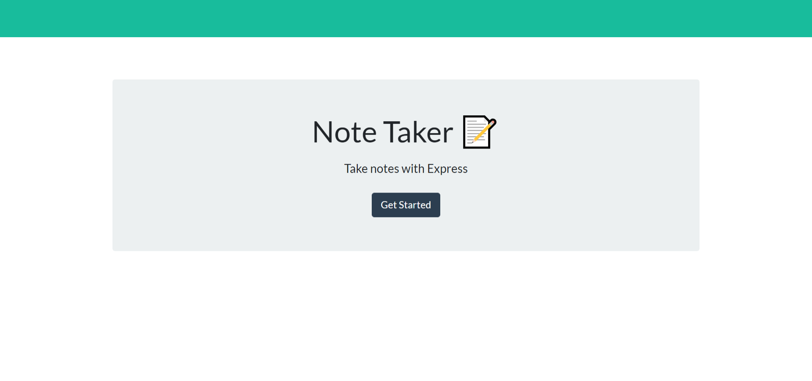
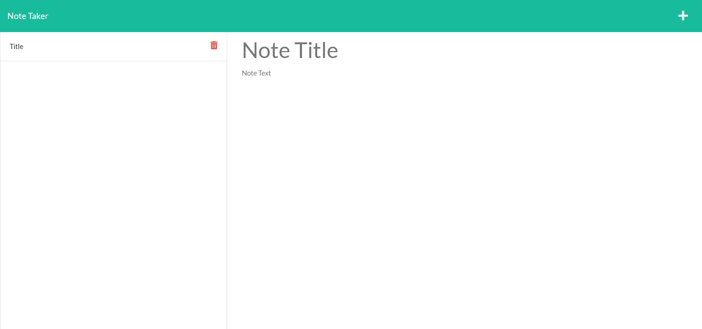

# Express Note Taker
 
  ## Description
  Use this program to take notes during your busy day. You can refer back to your notes at a later time. You can add and delete notes as needed.  

  ## Table of Contents
  [Installation](#Installation)  
  [Usage](#Usage)  
  [Contributing](#Contributing)   
  [Testing](#Testing)  
  [Questions](#Questions)  
  [License](#License) 
  
  ## Installation
  1. See Contributing for forking the repo
  2. Once these files are local on your machine
  3. Run 'npm install express uuidv4' in the terminal to install npm to create the necessary dependencies
  
  ## Usage

  ### Locally
  1. Run 'npm start' in the terminal to initiate the server
  2. Go to http://localhost:3002 
  3. Click on the Get Started button
  4. Add Notes by typing in title and text and pressing the save icon
  5. Continue to add as necessary
  6. To view an existing notes, click on note in left panel
  7. To delete notes press on the trash icon next to the note you want to delete

  [Click here to see walk-thru video](website-to-walk-throug-video)

  
  

  ### Heroku
  [Click here to visit the application on Heroku](https://express-note-taker-99.herokuapp.com)

  ## Contributing  
  
  ### Add to Project  
  To work on or add to this project follow these steps  
  1. Fork the repository  
  2. Add you changes  
  3. Submit a pull request for approval  
  
  ### Issues
  To add issues in GitHub follow these steps
  1. Click on the issues tab
  2. Click 'New issue' button
  3. Give the issue a title and comments
  4. Click 'Submit new issue' button

  [Click here to view current GitHub Issues](https://github.com/kimberlyamaya/express-note-taker/issues)   

  ## Testing

  1. Trash icon should delete the note corresponding to the note in the left panel
  2. Press this icon in a random order to make sure the correct note is being deleted

  ## Questions

  ### Contact
  For any questions please contact Kimberly Amaya 
  
  Email: [Link to Email](mailto:kimberly_kimbell@yahoo.com)  
  GitHub: [Link to GitHub Account](https://github.com/kimberlyamaya)  
  
  ## License
  This project contains a license from MIT 
  [Click here to see the license](license.txt)
   